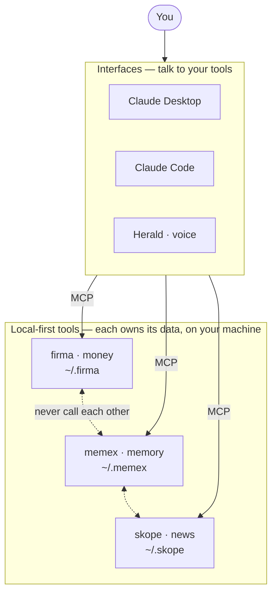

<p align="center">
  
</p>

<h1 align="center">skope</h1>

<p align="center">
  <strong>Your feed shows you everything.<br/>skope shows you what reaches <em>you</em>.</strong>
</p>

<p align="center">
  Stop hunting the news. Let Claude scan the world, keep only what has a path to your<br/>
  life — your money, your work, your country — and watch you against your own bubble.
</p>

<p align="center">
  <a href="https://www.npmjs.com/package/@evan-moon/skope"></a>
  <a href="https://github.com/evan-moon/skope/stargazers"></a>
  <a href="LICENSE"></a>
  <a href="https://nodejs.org/">= 22"></a>
  <a href="https://modelcontextprotocol.io"></a>
</p>

---

```
You:    Catch me up on today's news.
Claude: Scanning across your axes — TSLA, Toss, React, Seoul — and the world.
        Skimmed ~40 headlines, 9 reached you. Here's your brief:

        [Your radar]
        · Tesla Q3 deliveries beat estimates, TSLA +6%   (asset · Reuters · T1)
        · Toss parent Viva Republica eyes 2026 US IPO    (career · Yonhap · T2)
        · React 19 ships with the new compiler           (knowledge · The Verge)
        [The world]  Bank of Korea holds rates · UN climate summit opens

        ⚠ Attention check: 71% of this week sat on your asset axis (effective N=1.4).
        Want a cold-divergence pick to widen the lens?

You:    Why does a Brazil rate hike matter to me?
Claude: Brazil hiked → EM capital outflows → dollar strength → your USD-100%
        net worth and TSLA's valuation. Three steps, every one of them to you.
        A "Rio street festival" headline? Zero path. You'll never see it.
```

---

## Your feed optimizes for clicks. skope optimizes for *you*.

- **It talks to Claude. Natively.** Every step lives behind MCP — set your axes, ingest what Claude finds, assemble the brief, explain why a story matters. You ask in plain English; Claude does the searching and the writing. skope is the cold, deterministic ledger underneath.
- **A lens, not a filter.** Relevance isn't "did I keyword-match this?" — it's *Reachability*: does a causal path reach you? `Brazil rate hike → dollar → your TSLA` reaches you. `a stranger's daily life abroad` doesn't. You get broadened without getting flooded.
- **No API key. No crawler. No cost.** skope doesn't own an index or scrape the planet. Claude searches the web with the tools it already has and hands the results to skope. Nothing to sign up for, nothing to pay, nothing to operate. (A Tavily fallback exists for clients without their own web search.)
- **Local-first, no exceptions.** Your interest profile and reading history live in `~/.skope/skope.db`. No server, no account, no cloud. The only thing that ever leaves your machine is a search query.
- **A watcher, not just a recommender.** skope computes the *effective N* of your attention — the same concentration math a portfolio uses — and warns you when your reading collapses onto one axis. The recommender that hides your bias is the problem; skope surfaces it.
- **Built for the whole planet.** Trust is tiered — global anchors (Reuters/AP/Bloomberg), then *your country's* press (Yonhap, NHK, …) injected from where you live, then domain experts. A Korean-language local story from your national press reaches you without any English in it.
- **Federation, not dependency.** skope owns your profile. [firma](https://github.com/evan-moon/firma) and [memex](https://github.com/evan-moon/memex) are optional adapters — Claude reads them and feeds skope. skope never calls them, and never breaks if they're gone.

---

## Get started

```bash
# 1. Install
npm install -g @evan-moon/skope

# 2. Seed a profile (works with zero integrations)
skope init --location "Seoul, Korea" --languages ko,en

# 3. Connect Claude Desktop, then restart it
skope mcp install
```

Then just **talk to Claude**: *"set up my interests"* (it fills your axes), then *"what's my news today?"* Claude searches the web itself, hands the results to skope, and reads you back a brief — broad enough to break your bubble, narrow enough to skip a festival on the other side of the planet.

> If skope helps you see the news that actually reaches you, [⭐ star the repo](https://github.com/evan-moon/skope/stargazers) — it's the cheapest way to help others find it.

---

## How it's split: MCP thinks, the CLI keeps you safe

skope is **MCP-first**. Searching, scoring, briefing, explaining — all of it happens in conversation with Claude. The CLI exists for the things a chat can't safely own: **setup and inspection.**

```bash
# Setup
skope init --location "City, Country"   # seed a cold-start profile
skope config set tavily-key <key>       # optional — only for the scan_news fallback
skope mcp install                       # register with Claude Desktop

# Inspect (read-only)
skope profile                           # show your axes and weights
```

Everything else is a **conversation**. The MCP tools Claude drives:

| Tool | What it does |
|---|---|
| `show_profile` / `update_profile` | read / set your axes, weights, and location (the federation entry point) |
| `ingest_news` | **primary, key-less** — Claude searches the web, hands results here; skope dedups, tier-tags, and reachability-scores them |
| `scan_news` | fallback — skope fetches via Tavily when a client has no web search of its own |
| `get_brief` | assemble the two-layer brief: `[your radar]` + `[the world]` + the concentration meter |
| `mark_read` | drop seen stories from future briefs (deterministically) |

The boundary is the whole point: **collection is active and lives with the LLM; the ledger is deterministic and lives with skope** (URL/content dedup, rule-based reachability, trust-tiered ranking, effective-N — never LLM guesswork).

---

## Architecture

A Yarn Berry monorepo with a strict port-and-adapter layout. Business logic never imports an external API directly — it talks to domain interfaces, and adapters implement them.

```
packages/
  domain/        ports + types (Profile, Article, ReachabilitySeed, SearchProvider), zero external-API knowledge
  external-api/  raw clients (tavily) + trust-tier seed data (source-trust), zero domain knowledge
  adapter/       the only layer that imports both sides
  use-case/      business logic (profile, discovery, brief, watch)
  shared/        db + utils
apps/
  cli/  mcp/  docs/
```

**The rule:** `use-case` reaches the web only through the domain's `SearchProvider` port — never the concrete Tavily client. Trust tiering and reachability are pure, deterministic rules. Reachability stores only the rule-match *seed*; Claude renders the causal-chain narrative statelessly at brief time.

Verified end-to-end by 48 MCP scenarios across 5 adversarial test rounds (`test/mcp-tests-*.mjs`).

## Development

Requires Node.js 22+ and Yarn Berry.

```bash
corepack enable
yarn install
yarn build
yarn typecheck
yarn dev:mcp                    # run the MCP server over stdio
node test/mcp-tests.mjs         # end-to-end MCP regression suite
```

---

## The ecosystem

**skope** is one of three local-first tools that share one principle — **your data stays on your machine, and the AI comes to it.** They interoperate through any MCP client, and none depends on the others.



- **[firma](https://github.com/evan-moon/firma)** · money — portfolio, net worth, cash flow
- **[memex](https://github.com/evan-moon/memex)** · memory — notes and the context behind them, across sessions
- **[skope](https://github.com/evan-moon/skope)** · news — a personalized lens on the world

You reach them through Claude Desktop, Claude Code, Cursor — or **[Herald](https://ai-herald.vercel.app)**, a voice interface. The tools compose through the model, never by calling each other.

---

## License

MIT © [Evan Moon](https://github.com/evan-moon)
