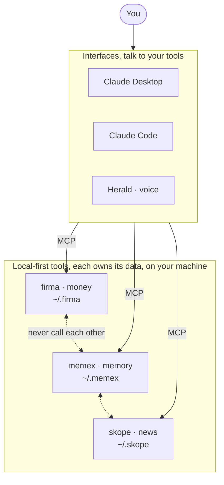

<p align="center">
  
</p>

<h1 align="center">skope</h1>

<p align="center">
  <strong>Your feed shows you everything.<br/>skope shows you what reaches <em>you</em>.</strong>
</p>

<p align="center">
  Stop hunting the news. Let Claude scan the world, keep only what has a path to your<br/>
  life (your money, your work, your country) and watch you against your own bubble.
</p>

<p align="center">
  <a href="https://www.npmjs.com/package/@evan-moon/skope"></a>
  <a href="https://github.com/evan-moon/skope/stargazers"></a>
  <a href="LICENSE"></a>
  <a href="https://nodejs.org/">= 22"></a>
  <a href="https://modelcontextprotocol.io"></a>
</p>

---

```
You:    Catch me up on today's news.
Claude: Reading your world, assets (TSLA, NVDA), work (Toss), stack (React),
        Seoul. Searched the literal names AND what *reaches* them (Fed, USD/KRW,
        chip controls). 12 stories reached you. Your brief:

        🎯 Reaches you, narrow & deep
        · US tightens Nvidia chip-export ban        (asset · keyword)
        · Fed holds; sticky CPI keeps rates high    (asset · reach: Fed → growth-stock valuations)
        · 금융위 DSR tightening hits household loans  (career · reach → Toss)

        🌏 Could affect you, broad & thin
        · M7.8 quake off the Philippines            (situational · your region)
        · Strait of Hormuz oil shock                (situational · energy)

        ⚠ Attention check: effective N = 3.1 across 5 axes, lens is wide today.

You:    Go deeper on the chip story.
Claude: [digs 3 passes] One export rule reaches you twice: it caps Nvidia's
        China revenue (your holding) and, via the Nasdaq-100 reshuffle, forces
        index funds to trim your Apple and Microsoft. Same week, two mechanical
        hits on the same book. Here's the chain, step by step…

        A "Rio street festival" headline? Zero path. You'll never see it.
```

---

## Your feed optimizes for clicks. skope optimizes for *you*.

- **It talks to Claude. Natively.** Every step lives behind MCP, set your axes, ingest what Claude finds, assemble the brief, explain why a story matters. You ask in plain English; Claude does the searching and the writing. skope is the cold, deterministic ledger underneath.
- **A lens, not a filter (and it broadens by causal path.** Relevance isn't "did I keyword-match this?") it's *Reachability*. Each interest carries not just its name but its **causal upstream**: your TSLA also pulls in the Fed, USD/KRW, and chip controls, so `Brazil rate hike → dollar → your TSLA` reaches you, while `a stranger's daily life abroad` doesn't. Searching only the literal names is what makes feeds feel repetitive; the upstream anchors are the lens.
- **Two bands: what reaches you, and what could.** Every brief has a **narrow & deep** band (news *about* you, your holdings, employer, stack) and a **broad & thin** band (the world that can *affect* you, your region, plus systemic shocks like energy, sanctions, supply chains, disasters). Peripheral vision, without the firehose: a curated set of world-systems is the gate, so an earthquake in your region surfaces and a celebrity tour doesn't.
- **A briefing, not a bullet list.** Claude renders the ledger as a research note, one causal throughline, the mechanism explained step by step in plain language, and a single thing to watch. Ask it to *go deeper* and it digs: each pass mines the last report's open questions to search the layer beneath.
- **A profile that stays alive.** Your axes aren't set once and frozen. skope reports what's still missing, and learns from what you actually read, promoting topics you keep returning to, flagging axes you've drifted away from, surfacing new interests you never declared. When [firma](https://github.com/evan-moon/firma)/[memex](https://github.com/evan-moon/memex) are connected, your asset axis fills from your portfolio and your interests from your notes.
- **No API key. No crawler. No cost.** skope doesn't own an index or scrape the planet. Claude searches the web with the tools it already has and hands the results to skope. Nothing to sign up for, nothing to pay, nothing to operate. (A Tavily fallback exists for clients without their own web search.)
- **Local-first, no exceptions.** Your interest profile and reading history live in `~/.skope/skope.db`. No server, no account, no cloud. The only thing that ever leaves your machine is a search query.
- **A watcher, not just a recommender.** skope computes the *effective N* of your attention (the same concentration math a portfolio uses) and warns you when your reading collapses onto one axis. The recommender that hides your bias is the problem; skope surfaces it.
- **Built for the whole planet.** Trust is tiered, global anchors (Reuters/AP/Bloomberg), then *your country's* press (Yonhap, NHK, …) injected from where you live, then domain experts. A Korean-language local story from your national press reaches you without any English in it.
- **Federation, not dependency.** skope owns your profile. [firma](https://github.com/evan-moon/firma) and [memex](https://github.com/evan-moon/memex) are optional adapters, Claude reads them and feeds skope. skope never calls them, and never breaks if they're gone.

---

## Get started

```bash
# 1. Install
npm install -g @evan-moon/skope

# 2. Seed a profile (works with zero integrations)
skope init --location "Seoul, Korea" --languages ko,en

# 3. Connect Claude Desktop, then restart it
skope mcp install
```

Then just **talk to Claude**: *"set up my interests"* (it fills your axes), then *"what's my news today?"* Claude searches the web itself, hands the results to skope, and reads you back a brief, broad enough to break your bubble, narrow enough to skip a festival on the other side of the planet.

> If skope helps you see the news that actually reaches you, [⭐ star the repo](https://github.com/evan-moon/skope/stargazers), it's the cheapest way to help others find it.

---

## How it's split: MCP thinks, the CLI keeps you safe

skope is **MCP-first**. Searching, scoring, briefing, explaining, all of it happens in conversation with Claude. The CLI exists for the things a chat can't safely own: **setup and inspection.**

```bash
# Setup
skope init --location "City, Country"   # seed a cold-start profile
skope config set tavily-key <key>       # optional, only for the scan_news fallback
skope mcp install                       # register with Claude Desktop

# Inspect (read-only)
skope profile                           # show your axes and weights
```

Everything else is a **conversation**. The MCP tools Claude drives:

| Tool | What it does |
|---|---|
| `show_profile` | read your axes, weights, location, plus a `gaps` report (what onboarding/refresh still needs to fill) |
| `update_profile` | set axes with their `reachAnchors` (causal-upstream topics), weights, and current location, the federation entry point |
| `ingest_news` | **primary, key-less**, Claude searches across keywords *and* reachAnchors, hands results here; skope dedups, tier-tags, and reachability-scores them. Pass `current_location` while traveling |
| `scan_news` | fallback, skope fetches via Tavily when a client has no web search of its own |
| `get_brief` | assemble the two-band brief (`[reaches you]` + `[could affect you]` + the world layer + the effective-N meter) re-scored against your *current* profile, for Claude to render as a research note |
| `reading_signal` | the living-profile signal, what you keep reading (promote to a keyword), axes you've drifted from (downweight), and reads with no path yet (new-interest candidates), all gated on your concentration |
| `mark_read` | drop seen stories from future briefs (deterministically) |

The boundary is the whole point: **collection is active and lives with the LLM; the ledger is deterministic and lives with skope** (URL/content dedup, rule-based reachability, trust-tiered ranking, effective-N, never LLM guesswork).

---

## Architecture

A Yarn Berry monorepo with a strict port-and-adapter layout. Business logic never imports an external API directly, it talks to domain interfaces, and adapters implement them.

```
packages/
  domain/        ports + types (Profile, Article, ReachabilitySeed, SearchProvider), zero external-API knowledge
  external-api/  raw clients (tavily) + trust-tier seed data (source-trust), zero domain knowledge
  adapter/       the only layer that imports both sides
  use-case/      business logic (profile, discovery, brief, watch)
  shared/        db + utils
apps/
  cli/  mcp/  docs/
```

**The rule:** `use-case` reaches the web only through the domain's `SearchProvider` port, never the concrete Tavily client. Trust tiering and reachability are pure, deterministic rules. Reachability stores only the rule-match *seed*; Claude renders the causal-chain narrative statelessly at brief time.

Verified end-to-end by 48 MCP scenarios across 5 adversarial test rounds (`test/mcp-tests-*.mjs`), plus a unit suite (`vitest`) covering reachability scoring, the situational band, brief assembly + freshness rotation, the living-profile signal, and a 5-persona validation matrix that proves the same article reaches different users via different paths, and drops for the wrong ones.

## Development

Requires Node.js 22+ and Yarn Berry.

```bash
corepack enable
yarn install
yarn build
yarn typecheck
yarn dev:mcp                    # run the MCP server over stdio
yarn test                       # unit suite (vitest)
node test/mcp-tests.mjs         # end-to-end MCP regression suite
```

---

## The ecosystem

**skope** is one of three local-first tools that share one principle, **your data stays on your machine, and the AI comes to it.** They interoperate through any MCP client, and none depends on the others.



- **[firma](https://github.com/evan-moon/firma)** · money, portfolio, net worth, cash flow
- **[memex](https://github.com/evan-moon/memex)** · memory, notes and the context behind them, across sessions
- **[skope](https://github.com/evan-moon/skope)** · news, a personalized lens on the world

You reach them through Claude Desktop, Claude Code, Cursor, or **[Herald](https://ai-herald.vercel.app)**, a voice interface. The tools compose through the model, never by calling each other.

---

## License

MIT © [Evan Moon](https://github.com/evan-moon)
